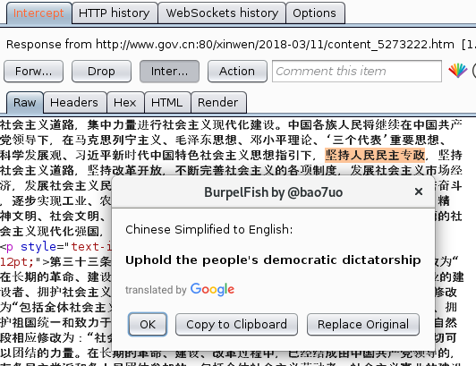

# BurpelFish

Adds Google Translate to Burp's Context Menu. For testing web apps in other languages.

Get an API key here: https://cloud.google.com/translate/docs/

Also works without an API key.

[]
