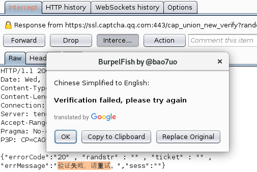

# BurpelFish Translator

Adds Google Translate to Burp's Context Menu. "BabelFish" language translation for testing apps in other languages.

- Get an API key here: https://cloud.google.com/translate/docs/

- Also works without an API key.

[]

## Requirements
- Configure Burp Extender Python Environment (Jython standalone Jar)
- Supports Windows, Linux and Mac

## Installation
- color-short.png must be in the same folder/directory as burpelfish.py

## Contribute
Contributions, feedback and ideas will be appreciated.

## Attribution
THIS SERVICE MAY CONTAIN TRANSLATIONS POWERED BY GOOGLE. GOOGLE DISCLAIMS ALL WARRANTIES RELATED TO THE TRANSLATIONS, EXPRESS OR IMPLIED, INCLUDING ANY WARRANTIES OF ACCURACY, RELIABILITY, AND ANY IMPLIED WARRANTIES OF MERCHANTABILITY, FITNESS FOR A PARTICULAR PURPOSE AND NONINFRINGEMENT.

## License notice
Copyright (C) 2018 Paul Taylor

See LICENSE file for details.
